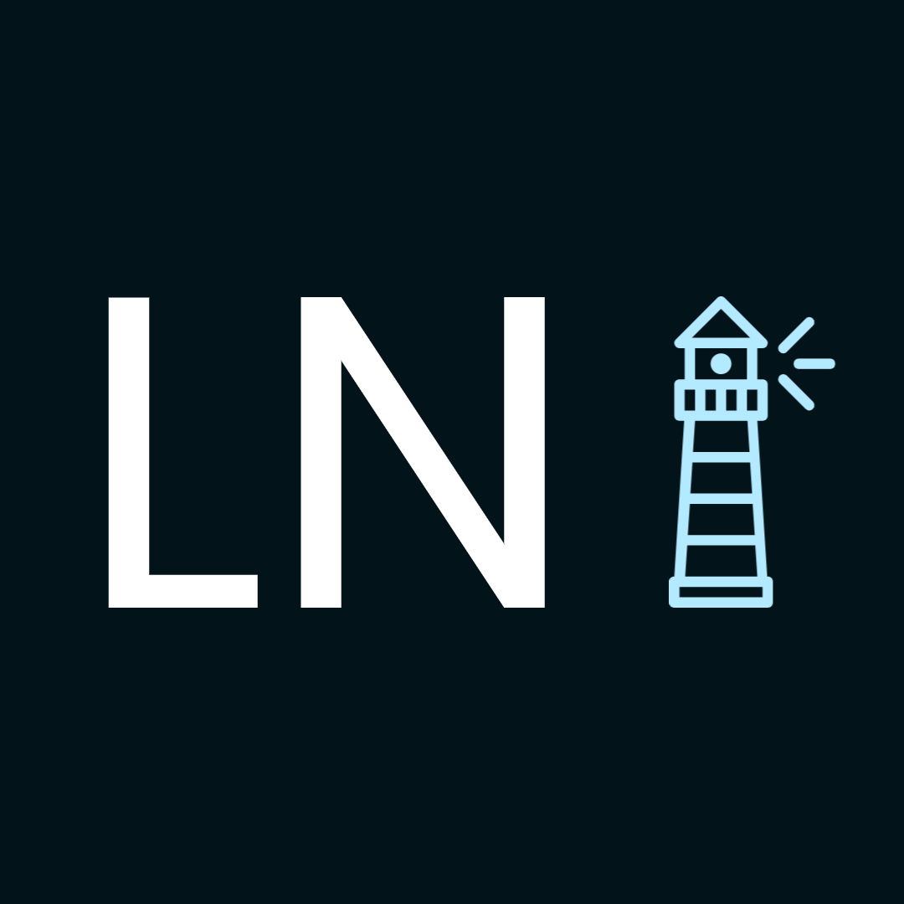
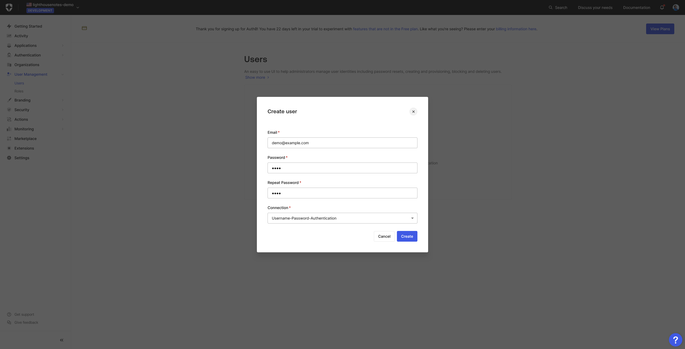

<div align="center">
    
    
</div>
<br />
<div align="center">
  <a href="https://github.com/lighthousenotes/server">
    
  </a>
</div>
<h2 align="center"> Lighthouse Notes Docker </h2>
<p align="center">
    Lighthouse Notes is a source available digital forensics note taking application
    <br>
    <a href="https://github.com/lighthousenotes/server/issues">Report Bug</a>
    ·
    <a href="https://github.com/lighthousenotes/server/discussions">Request Feature</a>
    ·
    <a href="https://github.com/lighthousenotes/server/discussions"> Get Support </a>
</p>

## About

Lighthouse is a university dissertation project which implements a source available digital forensics note taking application. With the following features:

- Authentication / Authorization
- User management
- Case management
- Basic exhibit management 
- Timestamped contemporaneous notes
- Custom tabs
- Image / Picture uploads
- Exhibit and user tagging
- MD5 and SHA256 hashing
- Storage of notes, tabs and images in a S3 bucket (encrypted using SSE-KMS)
- Localization settings
- Audit log

**This repository holds a script to generate a docker-compose file, nginx site configurations and a database initialization script**. As well as the instructions for how to deploy Lighthouse notes using docker.

## Prerequisites
- A domain name
- A public facing sever with `Docker`, `Docker Compose`, `Python` and `DotNet SDK` installed on
## Getting Started
### Domain
Make sure the following DNS records are created for your domain:
```
api.example.com		1	IN	A	1.2.3.4
app.example.com		1	IN	A	1.2.3.4
s3.example.com		1	IN	A	1.2.3.4
```
(Replace example.com with your own domain and 1.2.3.4 with the ip address of the public facing server).
### Synfusion
Register for a Synfusion license [here](https://www.syncfusion.com/sales/communitylicense). Depending on your company size and revenue you may be eligible for a free  community license.

After you have create an account and obtained a license, navigate to https://www.syncfusion.com/account/downloads. Click "Get License Key" and chose the following options:

- Platform - select ASP.NET, ASP.NET Core and Blazor
- Change version to 24.x.x

Click "Get License Key", copy the License Key and when prompted in the gen.py script enter it. 
> [!IMPORTANT]
> The license key will only be shown once!
### Auth0 
1. Create an Auth0 account and tenant following the instructions [here](https://auth0.com/docs/get-started/auth0-overview/create-tenants)

2. Navigate to Dashboard > Applications > APIs and create an API.

1. Navigate to Dashboard > Applications > Applications and create an application. Making sure to select "Regular Web Applications".


    Configure application Settings as follows 
    - Set "Application Login URI" to `https://app.example.com/account/login?returnUrl=` (replace example.com with your domain name).
    - Set "Allowed Callback URLs to `https://app.example.com/callback` (replace example.com with your domain name).
    - Set "Allowed Logout URLS to `https://app.example.com/` (replace example.com with your domain name).
    - Enable "Refresh Token Rotation"
    - Enable "Inactivity Expiration"..

    - Change to the "Organizations" section.

    - Click "Disable Grants Now".
    - Change "Types of Users" to "Business Users".
    - Change "Login Flow" to "Prompt for Credentials".

1. Create another application, this time selecting "Machine to Machine Applications".


1. Navigate to Dashboard > User Management > Roles and create the following roles (case sensitive):
    ```
    user
    sio
    organization-administrator 
    ```

   

2. Navigate to Dashboard > User Management > Users and create a user.

1. Navigate to Dashboard > Organizations and create an organization.


1. Change to the "Connections" panel and enable "Username-Password-Authentication" database connection by clicking "Enable Connections" and then selecting "Username-Password-Authentication" and clicking "Enable Connection".


1. Add the user to the organization by changing to the "Members" tab and clicking "Add Members".


1.   Click the "..." next to the member you just added and click "Assign Roles".


1.   Assign all the roles we created in step 5 (user, sio, and organization-administrator).


1. Navigate to Dashboard > Applications > APIs > API we created in step 2. Then click the "Machine To Machine Applications" tab and enable "Lighthouse Notes".

1. Navigate to Dashboard > Actions > Flows > Login. Click the + to add an action and choose Build from scratch". 


- Add the following code inside the `exports.onExecutePostLogin` function:
    ```javascript
    // Id token is the stored by the app
    api.idToken.setCustomClaim(`http://schemas.microsoft.com/ws/2008/06/identity/claims/role`, event.authorization.roles);
    api.idToken.setCustomClaim(`http://schemas.xmlsoap.org/ws/2005/05/identity/claims/emailaddress`, event.user.email);

    // Access token is used to call api
    api.accessToken.setCustomClaim(`http://schemas.microsoft.com/ws/2008/06/identity/claims/role`, event.authorization.roles);
    ```

    

- Click "Deploy" and then click "Add to flow" in the notification.

- Then drag the "Custom Claims" into the flow.

- Click "Apply".

### Script
1. Clone the Github repository with `git clone https://github.com/LighthouseNotes/Docker.git`.
2. Navigate to the repository with `cd Docker`.
3. Create a virtual environment with `python -m venv env`.
4. Activate the virtual environment with `source env/bin/activate` on Linux and MacOS or `env\Scripts\activate.bat`.
5. Install the requirements with `pip install -r requirements.txt`.
6. Run the script with `python gen.py`.
7. Follow the instructions.

### Usage
1. Download Synfusion Blink Libraries by visting https://www.syncfusion.com/account/downloads/studio/licensed/24_1_41, selecting Linux and scrolling down to the "Add-On" section and then clicking the "Download" button next to "HTML Converter for Linux".   
2. Unzip the file with `unzip syncfusionessentialhtmlconverter.zip "BlinkBinaries/*" -d "./BlinkBinaries"`
> [!IMPORTANT]
> The BlinkBinaries folder must be in the same directory as the docker-compose.yml file
3. Generate a self signed certificate `dotnet dev-certs https -ep lighthousenotes.pfx -p CHANGME` (replace CHANGEME with the password you specified in the script for the "Certificate Password" prompt).
4. Use the docker compose file `docker compose up -d`.
5. After a few minutes run `mv site-confs/* swag/nginx/site-confs/`.
6. Restart the SWAG container with `docker restart swag`.
7. Navigate to the S3 console by opening the following in a browser `https://s3.example.com:9001` (replace example.com with your own domain name).
8. Login with `minio` as the user and the password you specified in the script at the "Minio root password" prompt.
9.  Create a bucket named `lighthouse-notes` and enable "Versioning".

10.  Click on the newly created bucket.
11.  Click "Lifecycle", then "Add Lifecycle Rule" and set the lifecycle rule as follows:

12.    Navigate to the "Access Keys" section in the side menu, and create an access key. 
> [!IMPORTANT]
> Store the access key and secret key somewhere temporarily as they are only shown once!
13.    Open the application in a private web browser, by visiting app.example.com (replace example.com with your own domain name).
14.    Login with the user you created in the Auth0 section.
15.    Navigate to organization settings and change the S3 Access Key and Secret Key to ones you created in step 10.
16.    Change the Meilisearch API key to the key outputted at the end of the the gen.py script.
17.    Click "Save".
18.    Click the profile icon in top right and click "Profile" on this page click "Submit", this is to save your user information to Meilisearch so your user is searchable.
19.    Close the private browser windows and then use the app as normal in a normal browser window.